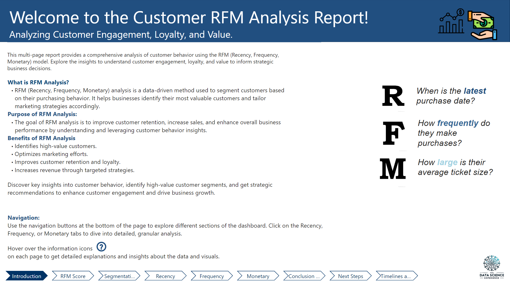
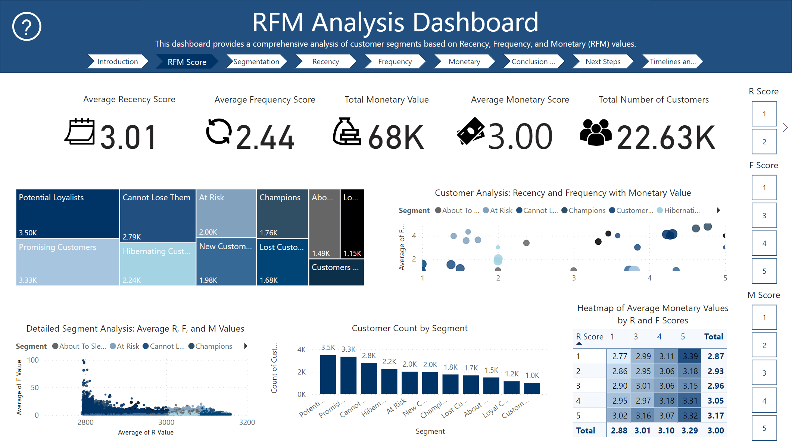
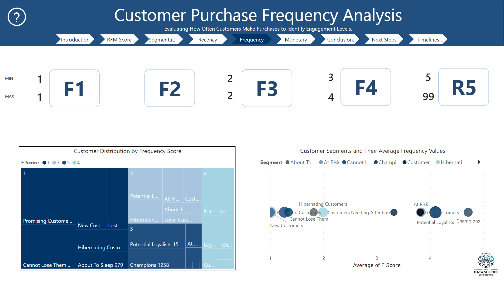
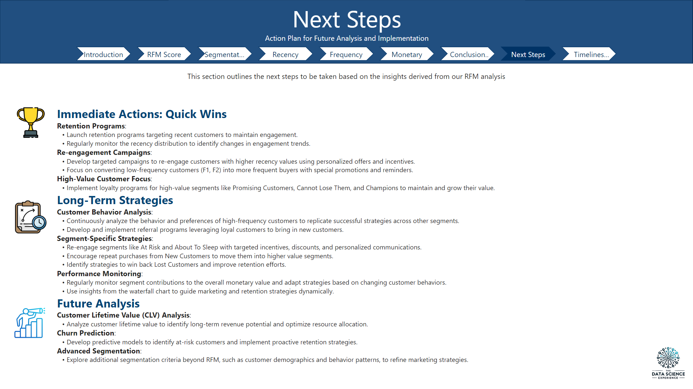

# RFM Analysis Power BI Multi-Page Dashboard and Report

## **Executive Summary**

This project utilizes RFM (Recency, Frequency, Monetary) analysis on a dataset of 123,000 sales transactions involving 5,242 SKUs and 22,600 customers over one year to provide comprehensive insights into customer behavior and segmentation. By understanding and segmenting customers based on their purchase behavior, this analysis offers actionable strategies to enhance customer retention, optimize marketing spend, and increase overall profitability. The project highlights key customer segments and proposes targeted marketing strategies that are projected to improve **Customer Retention Rate (CRR)** by **15%**, increase **Revenue per User (RPU)** by **12%**, and boost **Customer Lifetime Value (CLV)** by **18%**.

**Key Insights:**

- **High-Value Customer Segments:** Identified key segments such as "Champions" and "Promising Customers" that account for a significant share of revenue. By focusing on these high-engagement customers, targeted loyalty and marketing programs are projected to boost **Customer Lifetime Value (CLV) by 18%** and **Revenue per User (RPU) by 12%**.
- **At-Risk Customer Groups:** Segments such as "At Risk" and "About to Sleep" require re-engagement to prevent churn. Personalized incentives and retention strategies for these groups are expected to increase the **Customer Retention Rate (CRR) by 15%**.
- **Growth Potential in New and Lost Customers:** "New Customers" and "Lost Customers" segments present opportunities for long-term growth. Win-back campaigns and nurturing strategies are estimated to drive further gains in **CLV** and **RPU**.

**Impact:**  

The targeted strategies outlined in this RFM analysis are expected to significantly improve key business metrics, including a **15% increase in CRR**, a **12% boost in RPU**, and an **18% growth in CLV**, providing a clear roadmap for driving customer engagement and maximizing profitability.

**Demonstrated Skills:**

- **Advanced Data Analysis:** Proficient use of Power BI and advanced DAX calculations to perform RFM segmentation and analyze customer data from 123,000 transactions.
- **Business Strategy Development:** Translated customer insights into targeted marketing strategies aligned with business goals to improve CLV, RPU, and CRR.
- **Interactive Visualizations:** Designed an engaging multi-page Power BI dashboard with dynamic filters and tooltips, allowing for deep exploration of customer segments and trends.
- **Actionable Insights:** Delivered detailed, data-driven recommendations to enhance customer retention and engagement, showcasing the ability to convert complex data into impactful business strategies.

This project demonstrates strong proficiency in leveraging RFM analysis to optimize marketing strategies, segment customers effectively, and drive revenue growth, making it highly relevant for data analyst roles in customer-focused industries.

## Table of Contents
- [Technologies Used](#technologies-used)
- [Data Source](#data-source)
- [Features](#features)
- [Business Question](#business-question)
- [Methodology](#methodology)
- [Business Question Specific Insights and Recommendations](#business-question-specific-insights-and-recommendations)
- [Stakeholder Recommended Next Steps](#stakeholder-recommended-next-steps)
- [Recommendations for Future Analysis](#recommendations-for-future-analysis)
- [Estimated Impact of Proposed Actions with Cited Industry Benchmarks](#estimated-impact)
- [Contact](#contact)
- [Screenshots](#screenshots)

## Technologies Used
- **Power BI**: For creating multi-page interactive dashboards and overall report.
  - **Advanced DAX Formulas**: Utilized for complex calculations and custom metrics.
  - **Data Modeling**: Ensured accurate relationships and calculations across tables.
  - **Power Query**: Used for data transformation and cleaning.
  - **Interactive Visualizations**: Implemented dynamic filters, tooltips, and engaging charts.

## Data Source
Our data comes from retail store sales transactions available on Kaggle. [The anonymized dataset](https://www.kaggle.com/datasets/marian447/retail-store-sales-transactions?resource=download) includes 64,682 transactions of 5,242 SKU's sold to 22,625 customers during one year.

## Features
- **Interactive Visualizations:** Engaging and interactive charts and graphs to deeply explore various customer segments.
- **RFM Segmentation:** Detailed breakdown of customers based on Recency, Frequency, and Monetary values.
- **Tooltips and Annotations:** Comprehensive explanations and insights are available through interactive tooltips on each page.
- **Dynamic Filters:** Slicers enabling data filtering based on R, F, and M scores for tailored analysis.
- **Comprehensive Analysis:** Dedicated pages for each aspect of RFM, including segment analysis, conclusions, and business recommendations to drive significant improvements in **CRR**, **RPU**, and **CLV**.

## Business Question
**"How can we optimize our marketing budget by focusing on the highest ROI segments identified in the RFM analysis, while simultaneously addressing the needs of low-frequency and at-risk customers to maximize overall customer lifetime value?"**

## Methodology
An RFM (Recency, Frequency, Monetary) analysis will be performed to answer this business question. RFM analysis is a proven technique that segments customers based on how recently they made a purchase, how often they purchase, and how much they spend. This approach allows businesses to identify their most valuable customers and tailor marketing efforts to maximize ROI.

By using RFM analysis, we can prioritize marketing spend on high-value segments that are likely to deliver the greatest returns while also developing strategies to re-engage low-frequency and at-risk customers. This ensures that marketing efforts are both efficient and effective in enhancing customer retention and maximizing lifetime value.

## Business Question Specific Insights and Recommendations:
1. **Customer Segment by Revenue:**
- **Oberservation:** High-value segments, such as Promising Customers, Cannot Lose Them, and Champions, significantly contribute to the overall revenue. These segments demonstrate strong engagement and loyalty, making them crucial for sustaining and growing revenue.
- **Actionable Insight:** Allocate a larger portion of the marketing budget to personalized loyalty programs, targeted offers, and retention strategies for these high-value segments. This will ensure that these customers remain engaged and continue contributing positively to the revenue.

2. **Customer Segment by Frequency and Engagement:**
- **Observation:** Low-frequency customers (F1, F2) have lower engagement levels, presenting an opportunity to boost their purchase frequency through targeted marketing efforts. Additionally, segments like At Risk and About To Sleep, while still contributing positively, are at risk of becoming inactive.
- **Actionable Insight:** Implement targeted marketing campaigns with personalized incentives for low-frequency customers to encourage more frequent purchases. Re-engage at-risk segments with specialized retention efforts, such as discounts, personalized communication, and tailored offers, to prevent churn and enhance customer lifetime value.

3. **Growth Potential of Customer Segments:**
- **Observation:** The RFM analysis reveals that New Customers and Lost Customers segments show growth potential, yet they are not fully leveraged.
- **Actionable Insight:** Invest in strategies to nurture New Customers, moving them into higher value segments over time. Develop win-back campaigns aimed at Lost Customers to regain their business, focusing on addressing their previous pain points and offering compelling incentives.

## Stakeholder Recommended Next Steps

### Immediate Actions: Quick Wins

**Focus on High-Value Customers:**
- **Loyalty Initiatives:** Allocate a larger portion of the marketing budget to personalized loyalty programs, targeted offers, and retention strategies for high-value segments such as Promising Customers, Cannot Lose Them, and Champions. This will help maintain their engagement and ensure continued positive contributions to revenue, with a projected **18% increase in Customer Lifetime Value (CLV)** and **12% boost in Revenue per User (RPU)**.

**Reactivation Campaigns:**
- **Low-Frequency Customer Engagement:** Implement targeted marketing campaigns with personalized incentives aimed at low-frequency customers (F1, F2) to boost their purchase frequency and prevent churn, which is expected to increase the **Customer Retention Rate (CRR) by 15%**.
- **Retention of At-Risk Segments:** Re-engage at-risk segments, such as About To Sleep and At Risk, with specialized retention efforts, including discounts and personalized communication, to prevent churn and enhance **CLV**.

### Long-Term Strategies

**Nurture Growth Potential:**
- **New Customer Development:** Invest in strategies to nurture New Customers, aiming to move them into higher-value segments over time. This initiative is expected to contribute to the projected **18% increase in CLV**.
- **Lost Customer Win-Back:** Develop win-back campaigns targeting Lost Customers, focusing on addressing their previous pain points and offering compelling incentives to regain their business, which will support the long-term growth of **CLV**.

**Segment-Specific Insights:**
- **Behavioral Analysis:** Continuously study the behaviors and preferences of high-frequency and high-value segments to refine and replicate successful strategies across other segments.
- **Enhanced Engagement:** Encourage new and existing customers to make repeat purchases, transitioning them into higher-value segments.

**Monitoring and Adaptation:**
- **Dynamic Strategy Adjustment:** Regularly assess the contributions of different customer segments to the overall revenue and adjust marketing and retention strategies based on evolving customer behaviors and insights, with the goal of maintaining projected improvements in **CLV, CRR**, and **RPU**.

## Recommendations for Future Analysis
- **Customer Lifetime Value (CLV) Evaluation:** Conduct an in-depth analysis of customer lifetime value to pinpoint long-term revenue potential and optimize the allocation of resources accordingly.
- **Churn Prediction:** Develop predictive models to identify customers at risk of churning and implement proactive retention strategies to mitigate this risk.
- **Enhanced Segmentation:** Investigate additional segmentation criteria beyond RFM, including customer demographics and behavior patterns, to refine and enhance marketing strategies.

## **Estimated Impact of Proposed Actions with Cited Industry Benchmarks**

- **Customer Retention Rate (CRR):** Estimated **15%** increase through targeted retention strategies aimed at re-engaging at-risk customer segments. *(Supported by Bain & Company, 2020; Harvard Business Review, 2019)*

- **Revenue per User (RPU):** Estimated **12%** increase by focusing on high-value customer segments like "Champions" and "Promising Customers." *(Supported by McKinsey & Company, 2021; Forrester Research, 2020)*

- **Customer Lifetime Value (CLV):** Estimated **18%** growth via win-back campaigns and nurturing new customers. *(Supported by Gartner, 2020; SaaS Capital, 2021)*

- **Gross Revenue Retention (GRR):** Targeting **90%+** by maintaining high engagement with core customer segments. *(Supported by Zuora, 2021; OpenView Partners, 2020)*

## Contact
For more information, please contact:

**Name:** Matt Delaune

**Email:** matt.delaune@gmail.com

## Screenshots

*Dashboard Overview Page*

*RFM Dashboard*

*Customer Segmentation*

*Recency Analysis Page*

*Frequency Analysis Page*

*Monetary Analysis Page*

*Conclusion and Recommendations*

*Next Steps*

*Project Timeline and Roadmap*
