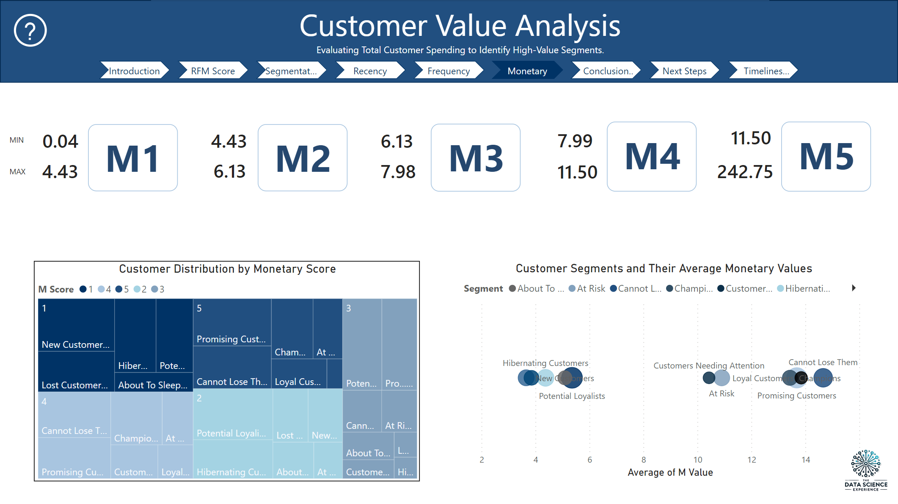

# Power BI RFM Analysis Dashboard

## Overview

This repository contains a comprehensive Power BI project that demonstrates advanced data visualization and analytical insights using Recency, Frequency, and Monetary (RFM) analysis. The project aims to segment customers based on their purchasing behavior to drive strategic business decisions.

## Table of Contents

- [Project Description](#project-description)
- [Features](#features)
- [Data Source](#data-source)
- [Usage](#usage)
- [Screenshots](#screenshots)
- [Insights and Analysis](#insights-and-analysis)
- [Future Work](#future-work)
- [Contact](#contact)

## Project Description

The RFM Analysis Dashboard is designed to help businesses understand their customer base by analyzing their purchasing behavior. This project leverages Power BI's advanced data visualization capabilities to segment customers and provide actionable insights.

## Features

- **Interactive Visualizations**: Detailed and interactive charts and graphs to explore customer segments.
- **RFM Segmentation**: Breakdown of customers based on Recency, Frequency, and Monetary values.
- **Tooltips and Annotations**: Detailed explanations and insights available through tooltips on each page.
- **Dynamic Filters**: Slicers for filtering data based on R, F, and M scores.
- **Comprehensive Analysis**: Pages dedicated to each aspect of RFM, including detailed segment analysis.

## Data Source

Our data comes from retail store sales transactions available on Kaggle. [The anonymized dataset](https://www.kaggle.com/datasets/marian447/retail-store-sales-transactions?resource=download) includes 64.682 transactions of 5.242 SKU's sold to 22.625 customers during one year.

Dataset Columns:
Date of Sales Transaction
Customer ID
Transaction ID
SKU Category ID
SKU ID
Quantity Sold
Sales Amount (Unit price times quantity. For unit price, please divide Sales Amount by Quantity.)

## Usage

1. Open Power BI Desktop and load the .pbix file.
2. Explore the interactive dashboard to analyze customer segments.
3. Use the slicers to filter data based on different R, F, and M scores.
4. Hover over the tooltips to gain deeper insights into the data.

## Screenshots

*Dashboard Overview Page*

*RFM Dashboard*

*Customer Segmentation*

*Recency Analysis Page*

*Frequency Analysis Page*

*Monetary Analysis Page*

*Conclusion and Recommendations*

*Next Steps*

*Project Timeline and Roadmap*

## Insights and Analysis

### Recency Insights
The majority of customers have made recent purchases, indicating high engagement.
A significant drop-off in customer count as recency values increase suggests a need for retention strategies.
### Frequency Insights
High-frequency customers are loyal and frequently return to make purchases.
Targeting low-frequency customers with marketing campaigns can increase their engagement.
### Monetary Insights
High-value segments like "Champions" and "Promising Customers" contribute significantly to revenue.
Segments at risk of churning need targeted campaigns to maintain their engagement.
### Future Work
Data Refresh: Implementing automatic data refresh to keep the dashboard updated.
Advanced Analytics: Adding predictive analytics to forecast customer behavior.
Publication: Exploring ways to publish the dashboard for broader access.

## Contact
For more information, please contact:

**Name:** Matt Delaune

**Email:** matt.delaune@gmail.com
